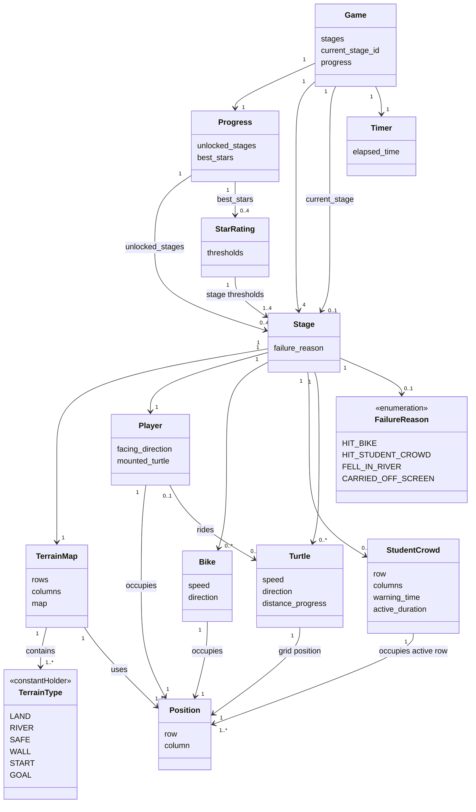

# Domain Model

## Modeling Notes

- Domain Model은 구현 클래스의 모든 메서드를 나열하지 않고, 게임 규칙을 이해하는 데 필요한 핵심 개념과 관계에 집중한다.
- `TerrainMap`은 스테이지의 정적 지형 레이어를 나타내며, row x column 구조의 `TerrainType` 정보를 가진다.
- `TerrainMap`의 강 칸은 진입 가능한 정적 지형이다. 자라가 없는 강 위에서의 추락 실패는 `Stage`가 판정한다.
- `Position`은 맵 위의 위치를 표현하는 값 객체이다.
- 목적지는 별도 `Goal` 개념으로 두지 않고 `TerrainType.GOAL`로 표현한다.
- 진행 상태는 스테이지 해금 상태와 스테이지별 최고 별점을 포함한다.
- 화면 전환, 사운드 재생, 이미지 리소스 로딩은 도메인 모델에서 제외하고 SSD, Sequence Diagram, Class Diagram에서 다룬다.

## Mermaid

## Concept Summary

| Concept | Meaning |
|---|---|
| Game | 전체 게임 진행 상태를 관리하는 상위 개념. 현재 스테이지, 진행도, 시간 흐름을 조율한다. |
| Stage | 캠퍼스의 특정 출발지에서 목적지까지 이동하는 하나의 구간이며, 지형과 동적 객체를 조합해 충돌, 추락, 탑승, 클리어를 판정한다. |
| TerrainMap | 스테이지를 구성하는 정적 지형 맵. 강 칸은 진입 가능 지형이며 추락 여부는 `Stage`가 판정한다. |
| TerrainType | 육지, 강, 안전지대, 벽, 시작 지점, 목적지 등 지형 종류를 나타내는 상수 집합이다. |
| Position | 맵 위의 row, column 위치를 나타내는 값 객체이다. |
| Player | 플레이어가 조작하는 kongoose(건구스). 현재 위치, 바라보는 방향, 탑승 중인 자라를 가진다. |
| Bike | 육지 구간의 이동 장애물이다. 행 방향으로 움직이며 화면 좌우를 순환한다. |
| StudentCrowd | 경고 시간 이후 일정 시간 동안 한 행 전체를 채우는 시간 기반 장애물이다. |
| Turtle | 강 구간의 이동 발판이다. 이동 진행률 50% 기준의 상호작용 위치로 탑승 판정을 돕는다. |
| FailureReason | 실패 원인. 자전거 충돌, 학생 무리 충돌, 강 추락, 화면 밖 밀림을 구분한다. |
| Timer | 스테이지별 경과 시간을 측정하는 개념이다. |
| StarRating | 스테이지별 클리어 시간 기준으로 1~3개 별점을 계산하는 개념이다. |
| Progress | 해금된 스테이지와 스테이지별 최고 별점을 관리하는 진행 상태이다. |
