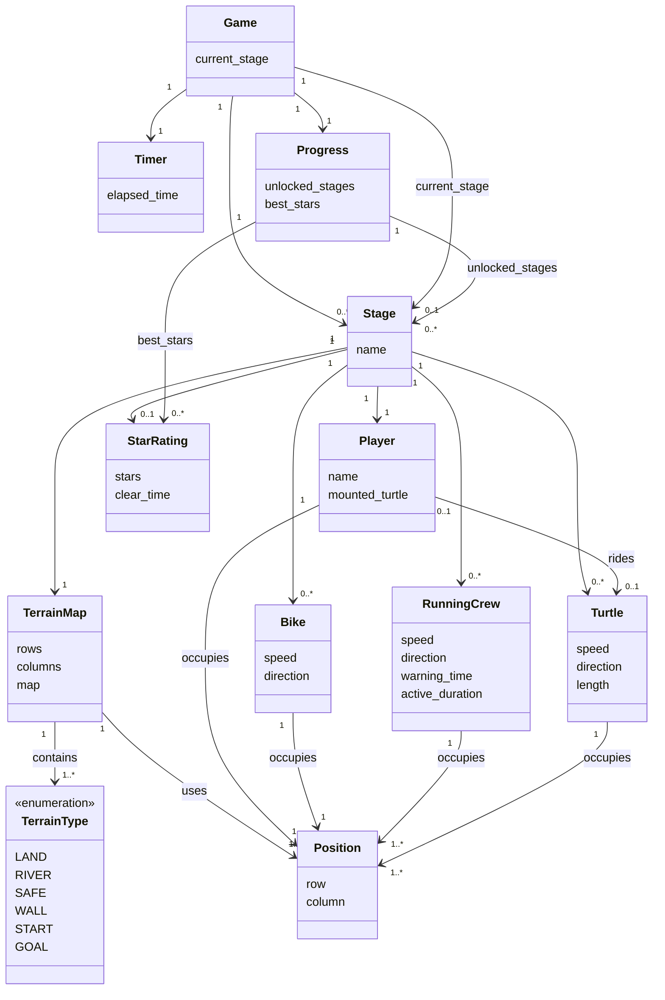

# Domain Model

## Modeling Notes

- Domain Model은 구현 클래스보다 게임 도메인의 핵심 개념과 관계에 집중한다.
- 식별 방식은 구현 단계에서 결정하므로 `stage_id` 같은 구현 중심 속성은 제외한다.
- `TerrainMap`은 스테이지의 정적 지형 레이어를 나타내며, row x column 구조의 `TerrainType` 정보를 가진다.
- `TerrainMap`의 강 칸은 진입 가능한 정적 지형으로 본다. 자라가 없는 강 위에서의 추락 실패는 `Stage`가 판정한다.
- `Position`은 맵 위의 위치를 표현하는 값 객체이다.
- 플레이어, 장애물, 발판처럼 맵 위에서 위치를 차지하는 대상은 `Position`과 관계를 가진다.
- 목적지는 별도 `Goal` 개념으로 두지 않고 `TerrainType.GOAL`로 표현한다.
- 진행 상태는 스테이지 해금 상태와 스테이지별 최고 별점을 포함한다.
- 화면 전환, 사운드 재생, 리소스 로딩은 도메인 모델에서 제외하고 SSD, Sequence Diagram, Class Diagram에서 다룬다.

## Mermaid

## Concept Summary

| Concept | Meaning |
|---|---|
| Game | 전체 게임 진행 상태를 관리하는 상위 개념 |
| Stage | 캠퍼스의 특정 출발지에서 목적지까지 이동하는 하나의 구간이며, 지형과 동적 객체를 조합해 충돌, 추락, 탑승, 클리어를 판정 |
| TerrainMap | 스테이지를 구성하는 정적 지형 맵. 강 칸은 진입 가능 지형이며 추락 여부는 Stage가 판정 |
| TerrainType | 육지, 강, 안전지대, 벽, 시작 지점, 목적지 등 지형 종류 |
| Position | 맵 위의 row, column 위치 |
| Player | 플레이어가 조작하는 건구스 |
| Bike | 육지 구간의 일반 이동 장애물 |
| RunningCrew | 육지 구간의 한 줄 전체를 채우는 특수 장애물 |
| Turtle | 강 구간의 이동 발판 |
| Timer | 스테이지별 경과 시간을 측정하는 개념 |
| StarRating | 클리어 시간에 따라 부여되는 스테이지별 별점 |
| Progress | 스테이지 해금 상태와 최고 별점을 관리하는 진행 상태 |
