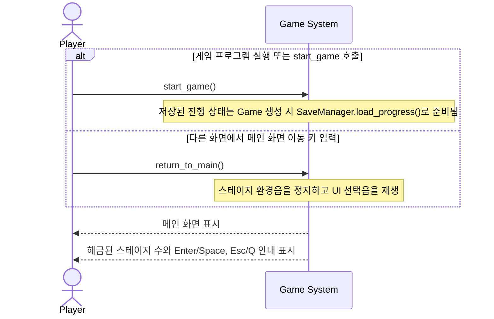
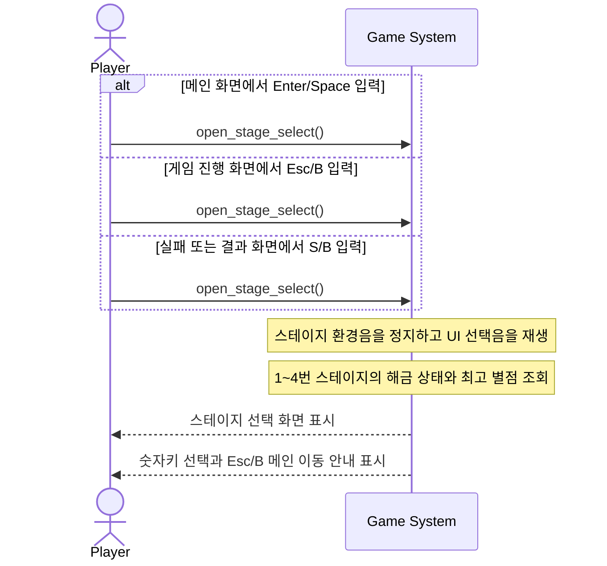
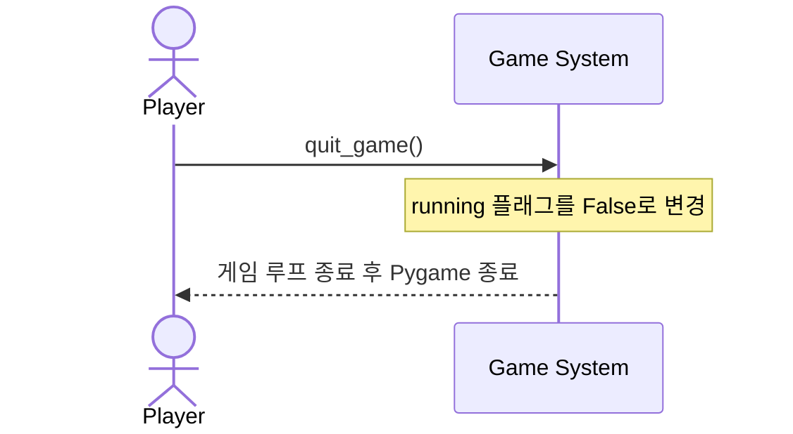
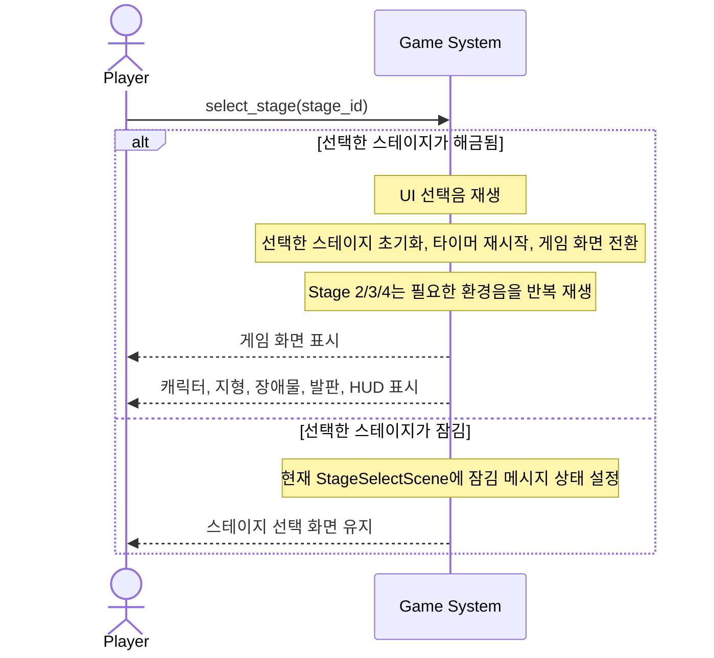
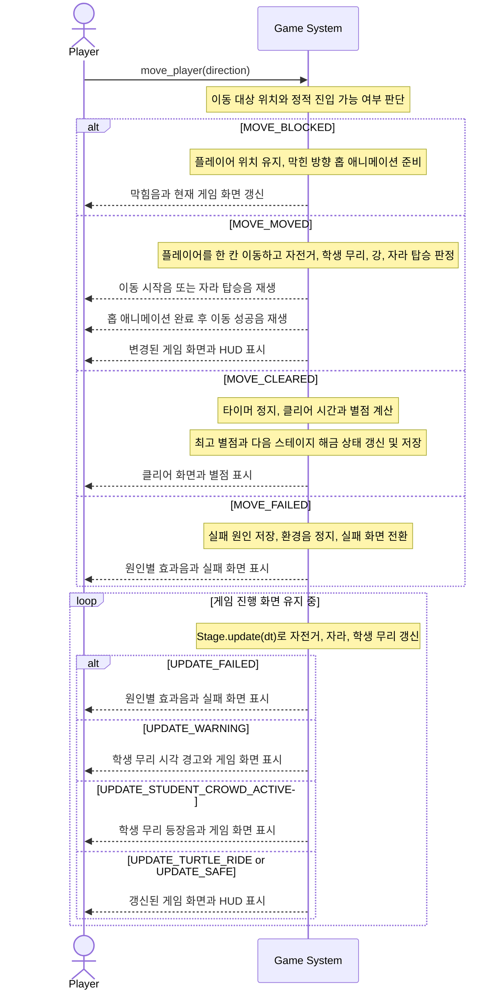
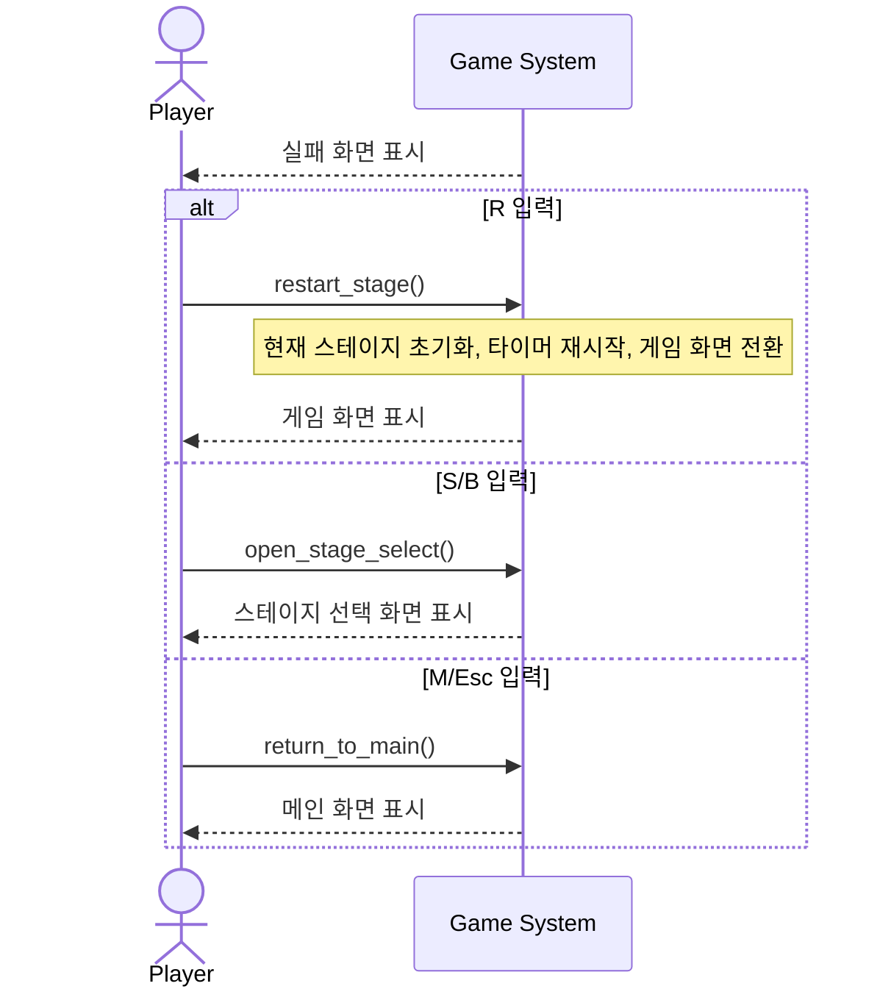
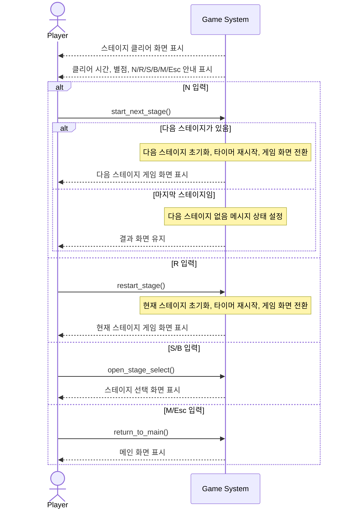

# System Sequence Diagrams

## Notes

- SSD는 Actor와 `Game System` 사이의 시스템 오퍼레이션 흐름만 표현한다.
- Actor에서 `Game System`으로 향하는 메시지는 시스템 오퍼레이션 이름을 기준으로 표기한다.
- 각 화면은 키 입력을 받은 뒤 대응되는 시스템 오퍼레이션을 요청한다. SSD에서는 이 내부 라우팅을 추상화한다.
- 시스템 오퍼레이션 이름은 `STYLE-01`에 따라 PEP 8의 snake_case를 따른다.
- 시스템 내부 처리는 메서드 호출처럼 표시하지 않고 `Note over System`으로 표현한다.
- 시스템이 플레이어에게 제공하는 화면, 메시지, 사운드, 이펙트는 `System-->>Player`로 표현한다.
- 게임 루프의 시간 흐름은 외부 Actor로 두지 않고, UC-05의 내부 반복 흐름으로 다룬다.
- Use Case와 SSD는 Traceability를 위해 1:1로 대응한다.

## System Operations

| Operation | Trigger | Related Use Case |
|---|---|---|
| `start_game()` | 게임이 메인 화면으로 진입함 | UC-01 |
| `return_to_main()` | 스테이지 선택 화면의 Esc/B, 실패/결과 화면의 M/Esc 입력 | UC-01, UC-06, UC-07 |
| `open_stage_select()` | 메인 화면의 Enter/Space, 게임 진행 화면의 Esc/B, 실패/결과 화면의 S/B 입력 | UC-02, UC-06, UC-07 |
| `quit_game()` | 메인 화면의 Esc/Q 입력 | UC-03 |
| `select_stage(stage_id)` | 스테이지 선택 화면의 숫자 1~4 입력 | UC-04 |
| `move_player(direction)` | 게임 화면의 방향키 입력 | UC-05 |
| `restart_stage()` | 실패/결과 화면의 R 입력 | UC-06, UC-07 |
| `start_next_stage()` | 결과 화면의 N 입력 | UC-07 |

## SSD-01 / UC-01 메인 화면 진입

## SSD-02 / UC-02 스테이지 선택 화면 진입

## SSD-03 / UC-03 게임 종료

## SSD-04 / UC-04 스테이지 선택

## SSD-05 / UC-05 캐릭터 이동

## SSD-06 / UC-06 실패 후 행동 선택

## SSD-07 / UC-07 클리어 후 행동 선택

