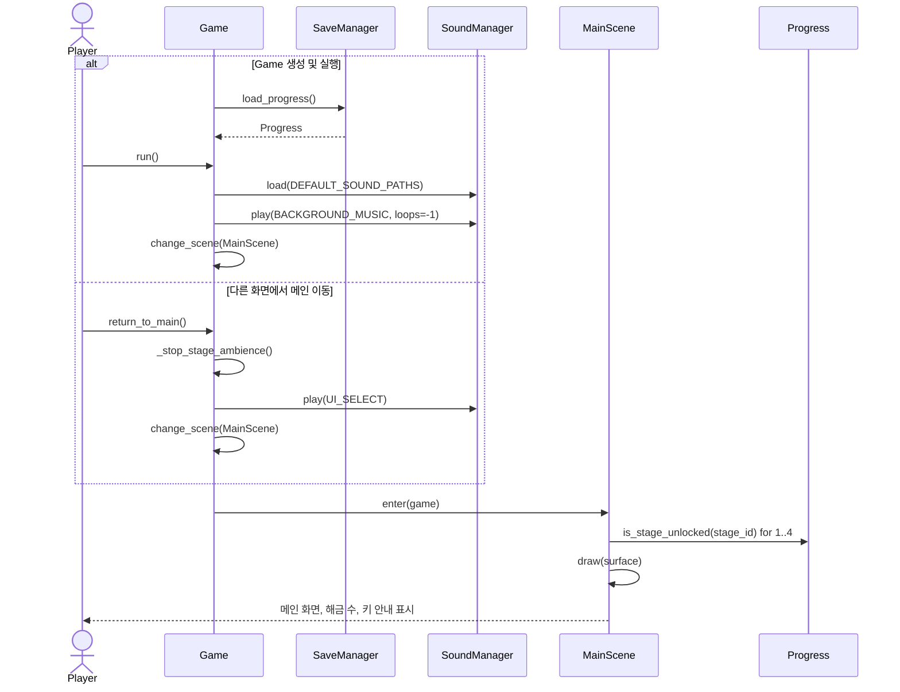
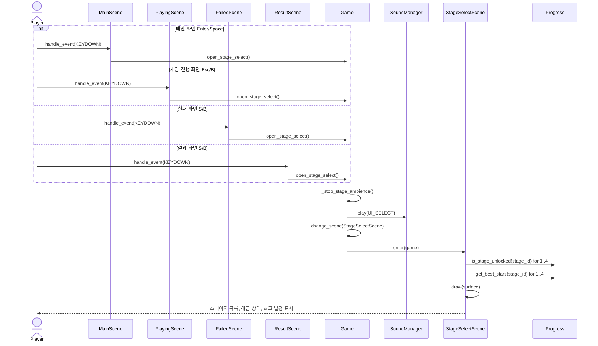
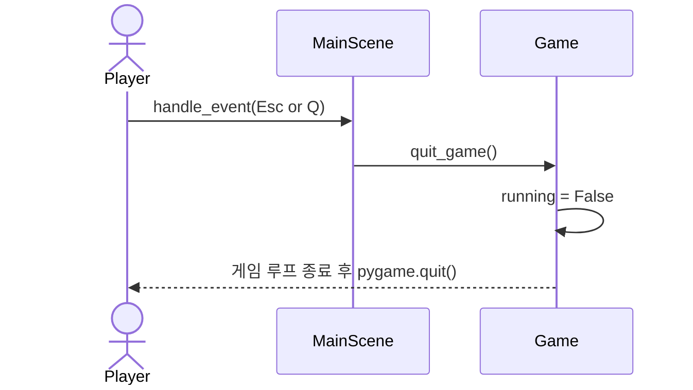
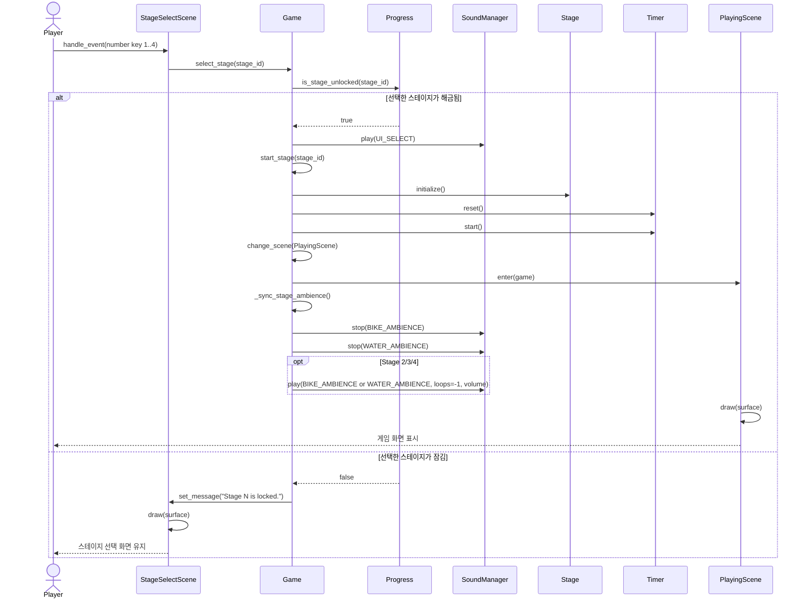
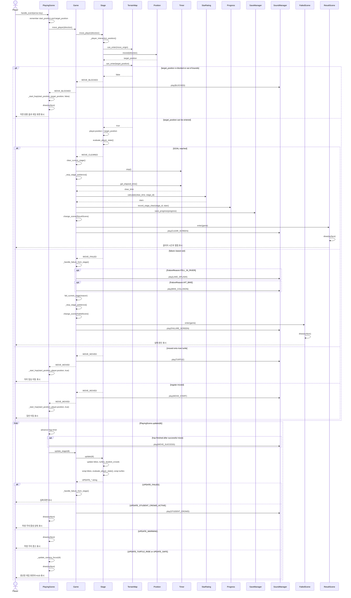
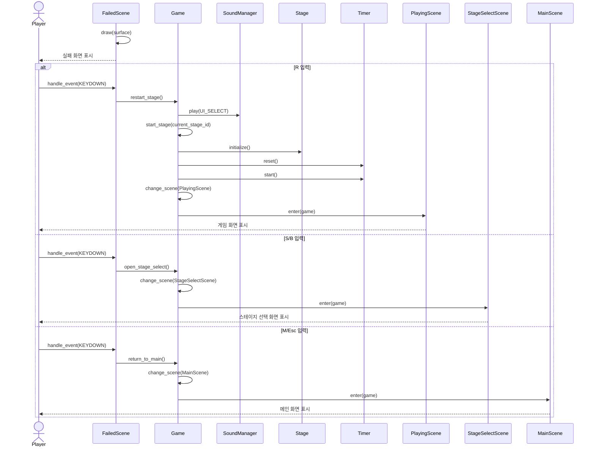
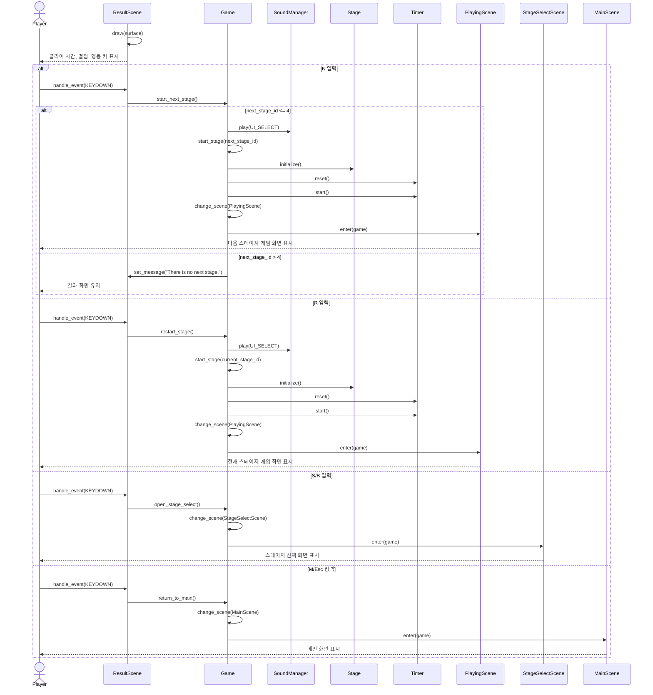

# Sequence Diagrams

## Notes

- 이 문서는 SSD보다 한 단계 내부 설계에 가까운 Sequence Diagram이다.
- 각 Sequence Diagram은 세부 설계의 주요 객체 호출 흐름을 기준으로 한다.
- 키 입력은 각 `Scene.handle_event(event)`가 받고, 필요한 경우 `Game` 공개 메서드를 호출한다.
- 별도 `ScreenManager`는 두지 않고, `Game.change_scene(scene)`가 현재 화면 객체를 교체한 뒤 `scene.enter(game)`를 호출한다.
- 게임 진행 화면의 2.5D 표현은 `StageRenderer`가 2D row/column 좌표를 얕은 등각 투영 화면 좌표로 변환해 그리는 렌더링 책임이다.
- `TerrainMap.can_enter(position)`은 맵 범위와 벽만 막으며, 강 칸은 막지 않는다.
- `Stage`는 지형과 동적 객체를 조합해 이동, 실패, 경고, 자라 탑승, 클리어를 판정한다.
- 이동 결과와 갱신 결과는 Result Object가 아니라 공통 모델의 문자열 상수이다.
- 자라 탑승과 하차 판정은 `Turtle.interaction_position()`을 사용한다. 이동 진행률이 50% 미만이면 현재 칸, 50% 이상이면 다음 칸을 기준으로 한다.
- `Goal` 클래스는 사용하지 않고 `TerrainType.GOAL`로 목적지를 표현한다.
- 사운드는 `SoundManager.play(cue, loops=0, volume=None)`와 `SoundManager.stop(cue)`로 처리한다.

## Traceability

| Sequence Diagram | Related Use Case | Main System Operation | Main Related FR |
|---|---|---|---|
| SD-01 | UC-01 메인 화면 진입 | `start_game()`, `return_to_main()` | FR-01, FR-02, FR-19, FR-20, FR-24 |
| SD-02 | UC-02 스테이지 선택 화면 진입 | `open_stage_select()` | FR-02, FR-03, FR-04, FR-13, FR-14, FR-20, FR-24 |
| SD-03 | UC-03 게임 종료 | `quit_game()` | FR-01 |
| SD-04 | UC-04 스테이지 선택 | `select_stage(stage_id)` | FR-02, FR-03, FR-04, FR-14, FR-24 |
| SD-05 | UC-05 캐릭터 이동 | `move_player(direction)` | FR-04, FR-05, FR-06, FR-07, FR-08, FR-09, FR-10, FR-11, FR-12, FR-16, FR-17, FR-18, FR-19, FR-20, FR-21, FR-22, FR-23, FR-24, FR-25 |
| SD-06 | UC-06 실패 후 행동 선택 | `restart_stage()`, `open_stage_select()`, `return_to_main()` | FR-02, FR-13, FR-15, FR-24 |
| SD-07 | UC-07 클리어 후 행동 선택 | `start_next_stage()`, `restart_stage()`, `open_stage_select()`, `return_to_main()` | FR-02, FR-03, FR-04, FR-13, FR-17, FR-18, FR-24 |

## SD-01 / UC-01 메인 화면 진입

## SD-02 / UC-02 스테이지 선택 화면 진입

## SD-03 / UC-03 게임 종료

## SD-04 / UC-04 스테이지 선택

## SD-05 / UC-05 캐릭터 이동

## SD-06 / UC-06 실패 후 행동 선택

## SD-07 / UC-07 클리어 후 행동 선택

