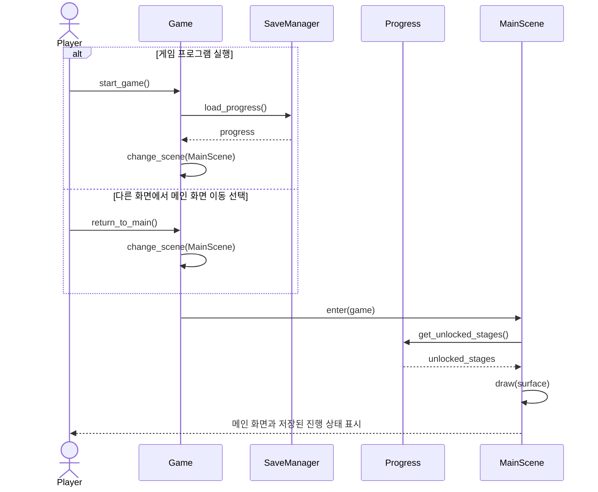
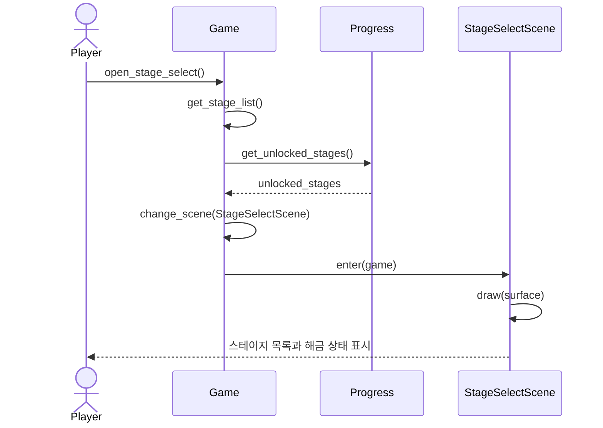
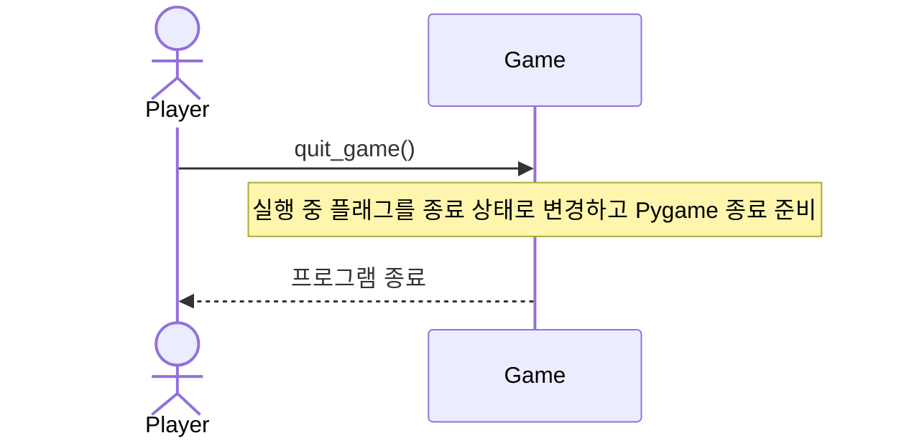
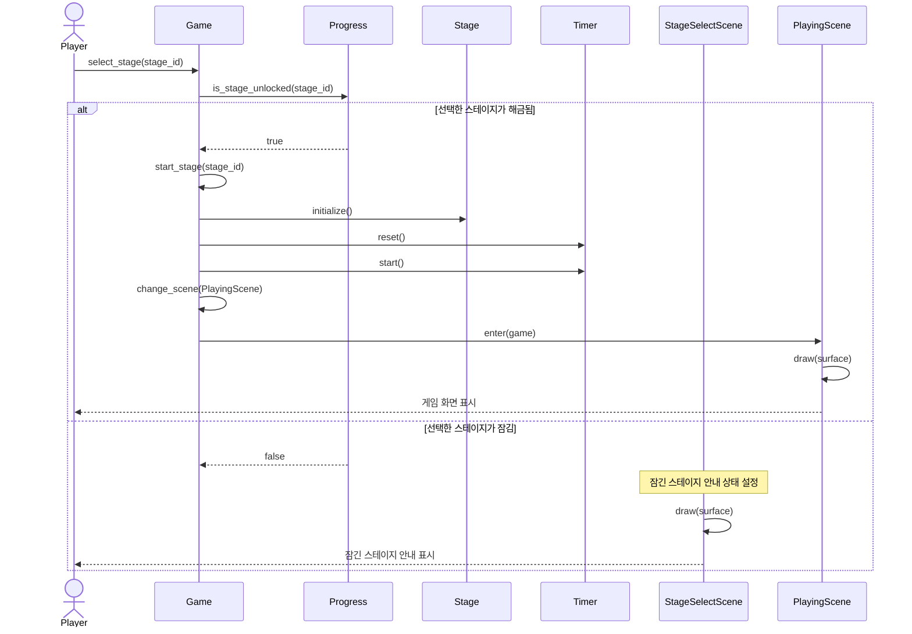
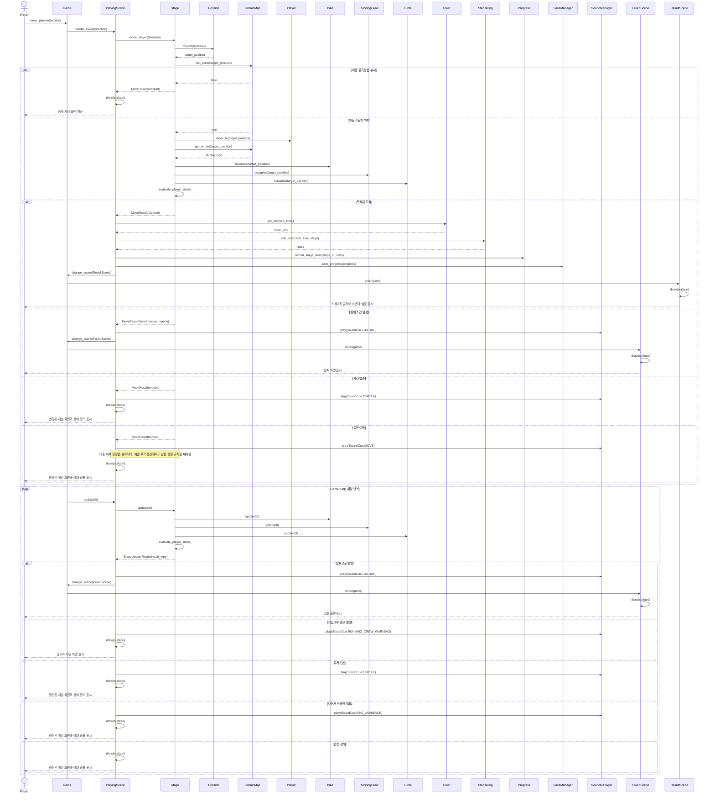
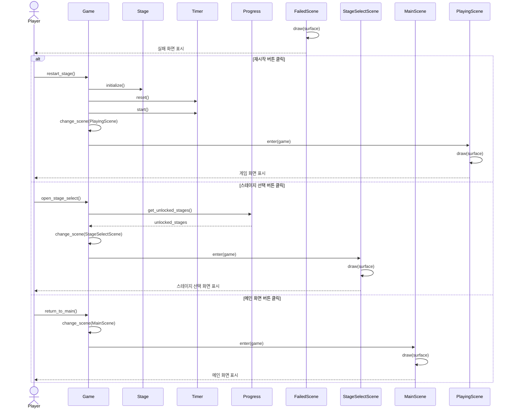
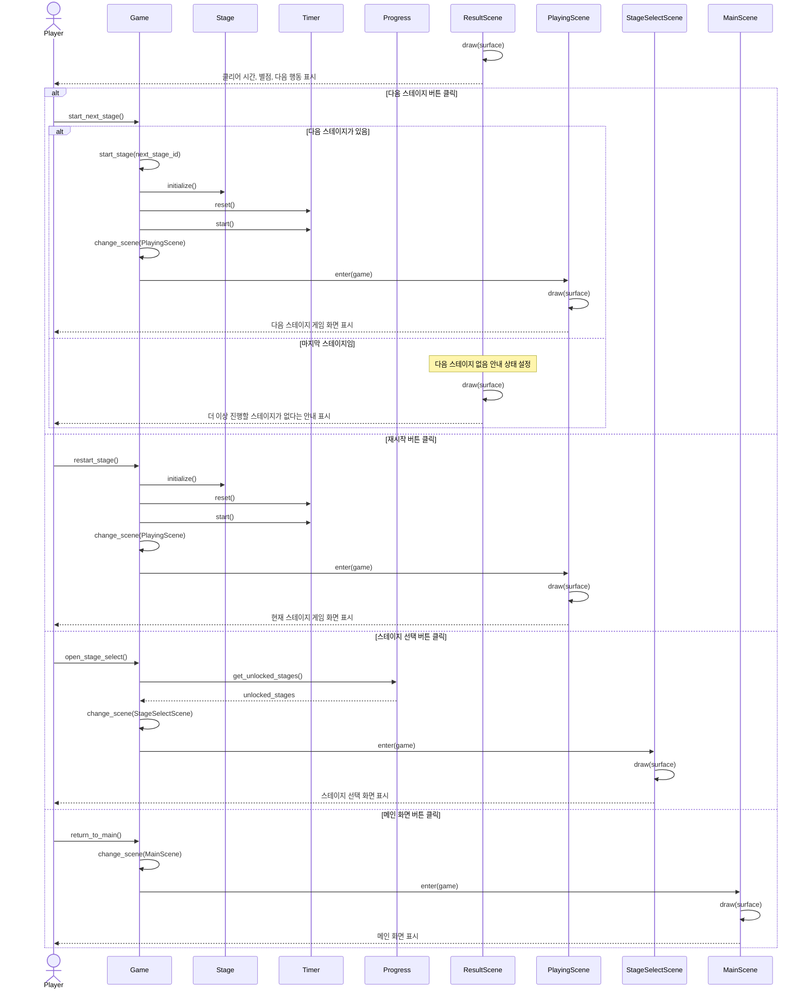

# Sequence Diagrams

## Notes

- 이 문서는 SSD보다 한 단계 내부 설계에 가까운 Sequence Diagram이다.
- 각 Sequence Diagram은 대응되는 SSD의 시스템 오퍼레이션에서 시작한다.
- Actor에서 `Game`으로 향하는 첫 메시지는 SSD의 시스템 오퍼레이션을 그대로 사용한다.
- 이후 객체 간 메시지는 Class Diagram의 책임과 PEP 8 명명 규칙을 따른다.
- 별도 `ScreenManager`는 두지 않고, 화면별 `Scene.draw(surface)`가 사용자에게 보이는 화면을 그린다.
- 게임 진행 화면의 2.5D 표현은 `PlayingScene.draw(surface)`에서 2D row/column 좌표를 얕은 등각 투영 화면 좌표로 변환해 표시하는 렌더링 책임이다. 이 표현은 `Stage`의 이동, 충돌, 실패, 클리어 판정 흐름을 바꾸지 않는다.
- `TerrainMap`은 맵 범위와 벽 같은 정적 진입 불가 지형을 판단하며, 강 칸은 `can_enter(position)`에서 막지 않는다.
- `Stage`는 지형과 동적 객체를 조합해 이동, 실패, 경고, 자라 탑승, 클리어를 판정한다. 같은 판정 규칙은 플레이어 이동 직후와 `Stage.update(dt)` 직후에 모두 적용한다.
- `Goal` 클래스는 사용하지 않고 `TerrainType.GOAL`로 목적지를 표현한다.
- 사운드는 소리별 메서드가 아니라 `SoundManager.play(cue)`로 재생한다.
- 게임 루프의 시간 흐름은 SSD의 Actor로 두지 않고, `Game.run()` 내부에서 현재 `Scene.update(dt)`와 `Scene.draw(surface)`가 반복되는 흐름으로 표현한다.
- Use Case와의 Traceability를 위해 `SD-01`부터 `SD-07`까지 `UC-01`부터 `UC-07`에 대응시킨다.

## Traceability

| Sequence Diagram | Related Use Case | System Operation | Main Related FR |
|---|---|---|---|
| SD-01 | UC-01 메인 화면 진입 | `start_game()`, `return_to_main()` | FR-01, FR-02, FR-19, FR-20, FR-24 |
| SD-02 | UC-02 스테이지 선택 화면 진입 | `open_stage_select()` | FR-02, FR-03, FR-04, FR-13, FR-14, FR-24 |
| SD-03 | UC-03 게임 종료 | `quit_game()` | FR-01 |
| SD-04 | UC-04 스테이지 선택 | `select_stage(stage_id)` | FR-02, FR-03, FR-04, FR-14, FR-24 |
| SD-05 | UC-05 캐릭터 이동 | `move_player(direction)` | FR-04, FR-05, FR-06, FR-07, FR-08, FR-09, FR-10, FR-11, FR-12, FR-16, FR-17, FR-18, FR-19, FR-20, FR-21, FR-22, FR-23, FR-24, FR-25 |
| SD-06 | UC-06 실패 후 행동 선택 | `restart_stage()`, `open_stage_select()`, `return_to_main()` | FR-02, FR-13, FR-15, FR-24 |
| SD-07 | UC-07 클리어 후 행동 선택 | `start_next_stage()`, `restart_stage()`, `open_stage_select()`, `return_to_main()` | FR-02, FR-03, FR-04, FR-13, FR-17, FR-18, FR-24 |

## SD-01 / UC-01 메인 화면 진입

## SD-02 / UC-02 스테이지 선택 화면 진입

## SD-03 / UC-03 게임 종료

## SD-04 / UC-04 스테이지 선택

## SD-05 / UC-05 캐릭터 이동

## SD-06 / UC-06 실패 후 행동 선택

## SD-07 / UC-07 클리어 후 행동 선택

