# Class Diagram

## Notes

- 이 다이어그램은 첫 버전의 Pygame 구현 설계를 표현한다.
- 화면 공통 기반 클래스는 `EmptyScene`으로 둔다. 별도 `Scene` 인터페이스 클래스는 두지 않는다.
- 이동 결과와 갱신 결과는 모듈 수준 문자열 상수로 두며, 별도 Result Object 클래스는 두지 않는다.
- `Direction`, `TerrainType`, `SoundCue`는 상수 보관용 클래스이고, `FailureReason`만 `Enum` 하위 클래스이다.
- `Bike`와 `Turtle`은 `GameSprite`를 상속하지만, `Player`와 `StudentCrowd`는 `GameSprite`를 상속하지 않는다.
- `StageCatalog`와 `RenderingHelpers`는 클래스가 아니라 모듈/함수 묶음을 다이어그램에서 표현한 것이다.
- `Game`은 Pygame 루프, 화면 전환, 스테이지 생명주기, 저장 진행도, 사운드, 리소스, 타이머, 별점 계산을 조율한다.
- `PlayingScene`은 입력, 홉 애니메이션, 카메라 포커스를 관리하고 스테이지 그리기는 `StageRenderer`에 위임한다.
- Mermaid 렌더러 호환성을 위해 일부 타입 표기는 단순화했다.

## Notation

- Visibility는 UML 표기를 따른다. `+`는 공개 멤버, `-`는 내부 구현용 멤버를 뜻한다.
- Python의 `_name` 관례를 따르는 속성과 메서드는 `-`로 표시한다.
- 상수 보관용 클래스와 `Enum` 값은 외부에서 참조되는 공개 클래스 속성이므로 `+`로 표시한다.
- Multiplicity는 객체가 지속적으로 보유하거나 참조하는 관계에 우선 표시한다.
- `..>` 의존 관계는 생성, 조회, 계산처럼 일시적으로 사용하는 관계이다.

## Mermaid

```mermaid
classDiagram
    direction LR

    class Game {
        +window_size
        +title
        +screen
        +clock
        +running: bool
        +current_scene
        +dict stages
        +SaveManager save_manager
        +Timer timer
        +SoundManager sound_manager
        +ResourceManager resource_manager
        +Progress progress
        +current_stage_id
        +last_failure_reason
        +last_clear_time
        +last_stars
        +current_stage
        +run() None
        +start_game() None
        +change_scene(scene) None
        +quit_game() None
        +open_stage_select() None
        +select_stage(stage_id: int) None
        +start_stage(stage_id: int) None
        +start_next_stage() None
        +restart_stage() None
        +return_to_main() None
        +move_player(direction: str) Optional~str~
        +update_stage(dt: float) None
        +fail_current_stage(reason) None
        +clear_current_stage() None
        -_handle_failure_from_stage() None
        -_handle_move_result(result) None
        -_handle_stage_update_result(result) None
        -_sync_stage_ambience() None
        -_stop_stage_ambience() None
    }

    class EmptyScene {
        -_background_color
        -_game
        -str _message
        +enter(game) None
        +update(dt: float) None
        +set_message(message: str) None
        -_require_game()
        -_dispatch_key(event, *bindings) bool
        -_draw_text_screen(surface, title, lines) None
        -_begin_text_screen(surface, title)
        -_dispatch_end_scene_keys(event, include_next) None
        -_draw_centered_text(surface, text, y, font, color) None
        -_draw_centered_lines(surface, lines, y, font, color)
        -_draw_message(surface, y, font) None
        -_get_asset_image(image_name)
        -_draw_star_line(surface, label, stars, y, font, icon_size) None
    }

    class MainScene {
        +handle_event(event) None
        +draw(surface) None
    }

    class StageSelectScene {
        +handle_event(event) None
        +draw(surface) None
    }

    class PlayingScene {
        -Optional~Position~ _hop_start_position
        -Optional~Position~ _hop_end_position
        -float _hop_elapsed
        -bool _hop_plays_success
        -Optional~Position~ _camera_focus
        -StageRenderer _renderer
        +handle_event(event) None
        +update(dt: float) None
        +draw(surface) None
        -_start_hop(start, end, plays_success) None
        -_ensure_camera_focus() Position
        -_update_camera_focus(dt: float) None
    }

    class FailedScene {
        +handle_event(event) None
        +draw(surface) None
    }

    class ResultScene {
        +handle_event(event) None
        +draw(surface) None
    }

    class StageRenderer {
        -_get_asset_image
        +draw(surface, stage, stage_id, elapsed_text, background_color, hop_state, camera_focus) None
        +draw_playing_hud(surface, title_font, body_font, stage_text, elapsed_text) None
        +calculate_grid_layout(width, height, rows, columns, focus)
        +draw_terrain_grid(surface, terrain_map, grid, cell_size, stage_id) None
        +draw_goal_images(surface, positions, grid, cell_size, stage_id) None
        +is_wide_goal_area(positions) bool
        +position_union_rect(positions, grid, cell_size)
        +draw_student_crowds(surface, crowds, terrain, grid, cell_size) None
        +draw_position_sprites(surface, sprites, grid, cell_size, style, columns) None
        +player_draw_rect(grid, cell_size, position, carried, hop_state, terrain_type)
        +sprite_draw_rects(sprite, grid, cell_size, columns)
        +is_crossing_map_edge(sprite, columns) bool
        +move_rect_by_sprite_progress(rect, sprite, cell_size, columns)
        +move_rect_by_grid_progress(rect, direction, progress, cell_size)
        +player_image(direction, hop_elapsed, is_hopping)
        +bike_image(bike)
        +turtle_image(turtle)
        +goal_image(stage_id, wide)
        +student_crowd_warning_image(crowd)
        +student_crowd_active_image(crowd)
        +cell_rect(grid, cell_size, position)
        +tile_points(grid, cell_size, position)
        -_draw_student_crowd_blocks(surface, crowd, terrain, grid, cell_size) None
        -_draw_student_crowd_warning(surface, crowd, terrain, grid, cell_size) bool
        -_draw_student_crowd_active(surface, crowd, terrain, grid, cell_size) bool
    }

    class Stage {
        +TerrainMap terrain_map
        +Player player
        +list~Bike~ bikes
        +list~StudentCrowd~ student_crowds
        +list~Turtle~ turtles
        +Optional~FailureReason~ failure_reason
        -_initial_player_state
        +initialize() None
        +move_player(direction: str) str
        +update(dt: float) str
        +evaluate_player_state() str
        -_fail(reason: FailureReason) str
        -_actor_at(actors, position)
        -_turtle_at(position) Optional~Turtle~
        -_player_interaction_position() Position
        -_wrap_position_sprites_in_bounds(sprites) None
        -_randomize_bike_start_columns() None
    }

    class TerrainMap {
        -_map
        +int rows
        +int columns
        +get_terrain(position: Position) str
        +can_enter(position: Position) bool
        -_is_in_bounds(position: Position) bool
    }

    class GameSprite {
        +Position position
        +str direction
        +float speed
        +float distance_progress
        -_initial_state
        -__post_init__() None
        +reset() None
        +update(dt: float) None
        +occupies(position: Position) bool
    }

    class Bike

    class Turtle {
        +interaction_position() Position
    }

    class StudentCrowd {
        +int row
        +int columns
        +float warning_time
        +float active_duration
        +float elapsed_time
        +bool became_active
        +update(dt: float) None
        +reset() None
        +should_warn() bool
        +is_active() bool
        +occupies(position: Position) bool
    }

    class Player {
        +Position position
        +str facing_direction
        +Optional~Turtle~ mounted_turtle
    }

    class Position {
        +int row
        +int column
        +moved(direction: str) Position
    }

    class Direction {
        <<constantHolder>>
        +UP
        +DOWN
        +LEFT
        +RIGHT
    }

    class TerrainType {
        <<constantHolder>>
        +LAND
        +RIVER
        +SAFE
        +WALL
        +START
        +GOAL
    }

    class FailureReason {
        <<enumeration>>
        +HIT_BIKE
        +HIT_STUDENT_CROWD
        +FELL_IN_RIVER
        +CARRIED_OFF_SCREEN
    }

    class SoundCue {
        <<constantHolder>>
        +MOVE_START
        +MOVE_SUCCESS
        +BLOCKED
        +TURTLE
        +BIKE_AMBIENCE
        +BIKE_COLLISION
        +STUDENT_CROWD
        +WATER_AMBIENCE
        +LAKE_SPLASH
        +FAILURE_SCREEN
        +CLEAR_SCREEN
        +UI_SELECT
        +BACKGROUND_MUSIC
    }

    class ResultConstants {
        <<module>>
        +MOVE_BLOCKED
        +MOVE_MOVED
        +MOVE_CLEARED
        +MOVE_FAILED
        +UPDATE_SAFE
        +UPDATE_WARNING
        +UPDATE_STUDENT_CROWD_ACTIVE
        +UPDATE_TURTLE_RIDE
        +UPDATE_FAILED
    }

    class Progress {
        +Optional~set~ unlocked_stages
        +Optional~dict~ best_stars
        -__post_init__() None
        +get_unlocked_stages() list~int~
        +is_stage_unlocked(stage_id: int) bool
        +get_best_stars(stage_id: int) int
        +record_stage_clear(stage_id: int, stars: int) None
        +to_dict() dict
        +from_dict(data: dict) Progress
    }

    class SaveManager {
        +save_path
        +load_progress() Progress
        +save_progress(progress: Progress) None
    }

    class SoundManager {
        +dict sounds
        +load(sound_paths) None
        +register_sound(cue: str, sound) None
        +play(cue, loops, volume) bool
        +stop(cue) None
    }

    class ResourceManager {
        +dict images
        +register_image(name: str, image) None
        +get_image(name: str)
    }

    class Timer {
        -_clock
        -_start_time
        -float _elapsed_time
        +start() None
        +stop() None
        +reset() None
        +get_elapsed_time() float
    }

    class StarRating {
        <<utility>>
        -_THRESHOLDS
        +calculate(clear_time: float, stage_id: int) int
    }

    class StageCatalog {
        <<module>>
        +build_default_stages() dict
        -_load_actors() dict
        -_build_stage(stage_id: int, actors: dict) Stage
        -_bike(row: dict) Bike
        -_student_crowd(row: dict) StudentCrowd
        -_turtle(row: dict) Turtle
        -_parse_layout(layout: list~str~) tuple
    }

    class RenderingHelpers {
        <<module>>
        +blit_scaled_centered(surface, image, target_rect) None
        +trim_transparent_margins(image)
    }

    EmptyScene <|-- MainScene
    EmptyScene <|-- StageSelectScene
    EmptyScene <|-- PlayingScene
    EmptyScene <|-- FailedScene
    EmptyScene <|-- ResultScene

    Game "1" --> "0..1" EmptyScene : current_scene
    EmptyScene "0..1" --> "1" Game : _game
    PlayingScene "1" *-- "1" StageRenderer : _renderer

    Game "1" *-- "1" SaveManager : save_manager
    Game "1" *-- "1" Timer : timer
    Game "1" *-- "1" SoundManager : sound_manager
    Game "1" *-- "1" ResourceManager : resource_manager
    Game "1" *-- "1" Progress : progress
    Game "1" o-- "4" Stage : stages
    Game "1" ..> "1" StageCatalog : build_default_stages()
    Game "1" ..> "1" StarRating : calculate()
    Game "1" ..> "0..*" SoundCue : play/stop
    Game "1" ..> "0..1" FailureReason : last_failure_reason
    Game "1" ..> "1" ResultConstants : handle results

    Stage "1" *-- "1" TerrainMap : terrain_map
    Stage "1" *-- "1" Player : player
    Stage "1" *-- "0..*" Bike : bikes
    Stage "1" *-- "0..*" StudentCrowd : student_crowds
    Stage "1" *-- "0..*" Turtle : turtles
    Stage "1" ..> "0..1" FailureReason : failure_reason
    Stage "1" ..> "1..*" TerrainType : terrain checks
    Stage "1" ..> "1" ResultConstants : returns strings

    Bike --|> GameSprite
    Turtle --|> GameSprite
    GameSprite "1" *-- "1" Position : position
    GameSprite "1" ..> "1" Direction : direction
    Turtle "1" ..> "1" Position : interaction_position()

    Player "1" *-- "1" Position : position
    Player "1" o-- "0..1" Turtle : mounted_turtle
    Player "1" ..> "1" Direction : facing_direction

    StudentCrowd "1" ..> "1" Position : occupies()
    TerrainMap "1" ..> "1" Position : lookup
    TerrainMap "1" ..> "1..*" TerrainType : tile values
    Position "1" ..> "1" Direction : moved()

    StageRenderer "1" ..> "1" Stage : draw()
    StageRenderer "1" ..> "1" TerrainMap : draw_terrain_grid()
    StageRenderer "1" ..> "1..*" Position : cell_rect()
    StageRenderer "1" ..> "1" Direction : image/progress
    StageRenderer "1" ..> "1..*" TerrainType : colors
    StageRenderer "1" ..> "1" RenderingHelpers : blit/trim

    SaveManager "1" ..> "1" Progress : load/save
    SoundManager "1" ..> "0..*" SoundCue : cue keys
    StageCatalog "1" ..> "4" Stage : creates
    StageCatalog "1" ..> "4" TerrainMap : creates
    StageCatalog "1" ..> "4" Player : creates
    StageCatalog "1" ..> "0..*" Bike : creates
    StageCatalog "1" ..> "0..*" StudentCrowd : creates
    StageCatalog "1" ..> "0..*" Turtle : creates
    StageCatalog "1" ..> "1..*" Position : parses
```

## Responsibility Summary

| Class or Module | Responsibility |
|---|---|
| `Game` | Pygame 초기화와 메인 루프, 화면 전환, 현재 스테이지 생명주기, 진행도 저장, 사운드, 리소스, 시간, 별점 계산 조율 |
| `EmptyScene`과 하위 클래스 | 화면별 입력 처리와 그리기 담당. 메인, 스테이지 선택, 플레이, 실패, 결과 화면으로 나뉜다. |
| `PlayingScene` | 플레이 화면의 방향키 입력, 홉 애니메이션 상태, 카메라 포커스, 렌더러 위임 담당 |
| `StageRenderer` | 스테이지 격자 상태를 Pygame 그리기 호출과 이미지 리소스 조회로 변환 |
| `Stage` | 이동, 액터 갱신, 충돌/실패, 목표 도달, 자라 탑승, 액터 초기화/순환 같은 핵심 스테이지 규칙 담당 |
| `TerrainMap` | row/column 지형 격자를 검증해 저장하고 지형 조회와 진입 가능 여부를 응답 |
| `GameSprite` | 이동 스프라이트의 위치, 방향, 속도, 진행률, 초기화, 이동, 점유 판정 공통 동작 |
| `Bike` | `GameSprite` 동작을 그대로 쓰는 이동 장애물 |
| `Turtle` | 강 구간 이동 발판. 진행률 50% 이후에는 다음 칸을 상호작용 위치로 제공 |
| `StudentCrowd` | 경고 시간 이후 일정 시간 동안 행 전체를 점유하는 시간 기반 장애물 |
| `Player` | 플레이어 위치, 바라보는 방향, 탑승 중인 자라 상태 |
| `Position` | row/column 위치 값 객체와 방향 기반 이동 계산 |
| `Progress` | 해금된 스테이지와 스테이지별 최고 별점 관리 |
| `SaveManager` | `Progress`의 JSON 저장과 불러오기 |
| `SoundManager` | Pygame 사운드 로딩, 재생, 볼륨 적용, cue별 정지 |
| `ResourceManager` | 화면과 렌더러가 사용하는 이미지 메모리 캐시 |
| `Timer` | 스테이지 경과 시간 측정 |
| `StarRating` | 스테이지별 클리어 시간 기준 별점 계산 |
| `StageCatalog` | 맵/액터 데이터 파일을 읽어 기본 스테이지를 생성하는 팩터리 모듈 |
| `ResultConstants` | `Stage`와 `Game` 사이에서 이동/갱신 결과를 전달하는 문자열 상수 묶음 |
| `RenderingHelpers` | 이미지 스케일링과 투명 여백 제거를 돕는 렌더링 보조 함수 묶음 |
