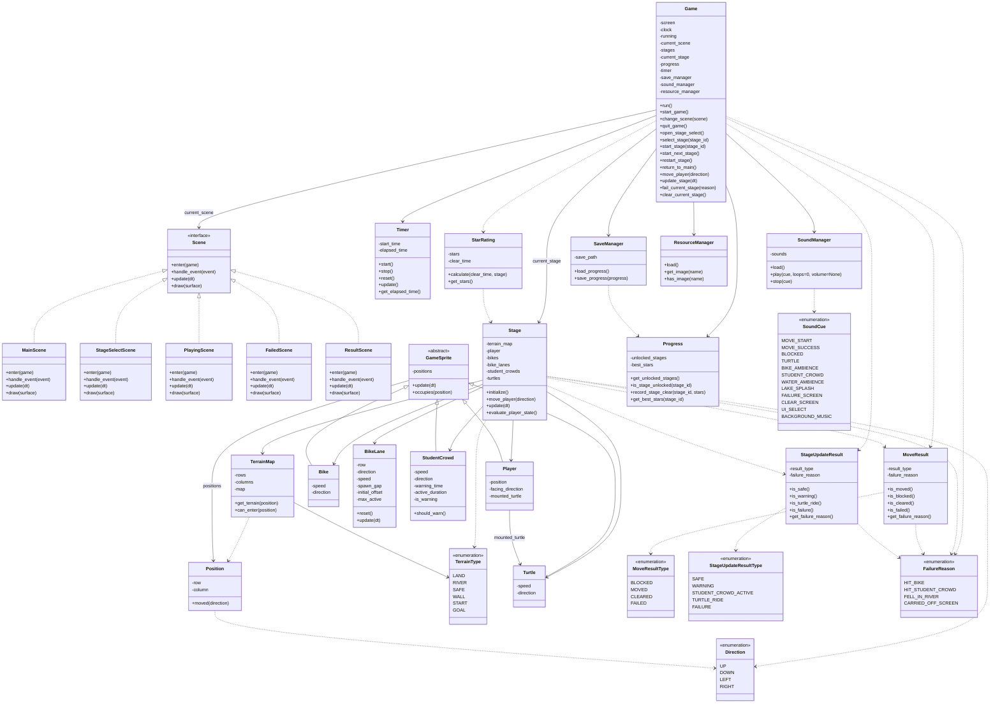

# Class Diagram

## Notes

- 이 문서는 구현을 위한 1차 Class Diagram이다.
- Domain Model이 개념 중심이라면, Class Diagram은 Pygame 구현을 염두에 둔 책임 중심 구조를 표현한다.
- 이 문서의 클래스, 메서드, 속성 이름은 `STYLE-01`에 따라 PEP 8 명명 규칙을 따른다.
- `Progress`는 스테이지 해금과 최고 별점 규칙을 담당하고, `SaveManager`는 저장/불러오기 동작을 담당한다.
- `Game`은 Pygame 초기화, 메인 루프, 현재 `Scene` 보관과 전환을 담당한다.
- 별도 `SceneManager`는 두지 않는다. 현재 씬을 가지고 갈아끼우는 정도의 책임은 `Game.change_scene(scene)`으로 충분하다.
- `Scene` 계층은 화면 상태별 입력, 갱신, 렌더링 책임을 나눈다.
- `PlayingScene`은 게임 진행 화면을 그릴 때 2D row/column 격자 좌표를 얕은 등각 투영 화면 좌표로 변환한다. 이 변환은 렌더링 전용이며 `Stage`, `TerrainMap`, `Position`의 판정 규칙을 바꾸지 않는다.
- `TerrainMap`은 파일에서 읽은 row x column 구조의 정적 지형 레이어를 관리한다. `can_enter(position)`은 맵 범위와 벽 같은 정적 진입 불가 지형만 판단하며 강 칸은 막지 않는다.
- `Stage`는 `TerrainMap`과 동적 객체를 조합해 이동, 갱신, 충돌, 실패, 클리어를 판정한다. `evaluate_player_state()`는 플레이어 이동 직후와 동적 객체 갱신 직후에 같은 규칙으로 호출된다.
- `Position`은 row, column을 가진 위치 값 객체이며 원시 tuple 대신 사용한다.
- `GameSprite`는 위치를 가지고 갱신되거나 점유 판정이 필요한 스테이지 객체의 공통 추상 클래스이다.
- 목적지는 별도 `Goal` 클래스로 두지 않고 `TerrainType.GOAL`로 표현한다.
- `MoveResult`와 `StageUpdateResult`는 `Stage`가 판정한 결과를 `Game`에 전달하는 Result Object이다.
- `Direction`, `MoveResultType`, `StageUpdateResultType`, `FailureReason`은 판정 결과와 실패 원인을 명확히 하기 위한 열거형이다.
- `SoundManager`는 소리 종류별 메서드를 따로 두지 않고 `SoundCue`를 받아 재생하며, 필요한 경우 1회 재생 볼륨을 적용한다. 강물처럼 반복 재생되는 큐는 `stop(cue)`로 정지한다.
- 선택 기능과 보류 기능은 포함하지 않는다.

## Mermaid

## Responsibility Summary

| Class | Responsibility |
|---|---|
| Game | Pygame 초기화와 메인 루프, 현재 Scene 보관과 전환, 현재 스테이지 진행 조율 |
| Scene 계층 | 화면 상태별 입력 처리, 갱신, 렌더링 분리 |
| PlayingScene | 방향키 입력을 스테이지 이동 요청으로 전달하고, 게임 진행 화면에서 2D 격자 상태를 얕은 등각 투영 2.5D 표현으로 렌더링 |
| Stage | 스테이지의 플레이어와 동적 객체 상태를 관리하고 지형과 객체를 조합해 이동, 갱신, 충돌, 추락, 자라 탑승, 클리어 판정 |
| TerrainMap | row x column 구조의 정적 지형 맵과 맵 범위·벽 기준 진입 가능 여부 관리. 강 추락 여부는 판단하지 않음 |
| Position | row, column을 가진 위치 값 객체 |
| TerrainType | LAND, RIVER, SAFE, WALL, START, GOAL 등 정적 지형 종류 표현 |
| Direction | 플레이어와 동적 객체의 이동 방향 표현 |
| GameSprite | 위치 점유와 시간 갱신이 필요한 스테이지 객체의 공통 추상화 |
| Player | 건구스의 현재 위치, 이동, 자라 탑승 상태 관리 |
| Bike | 육지 구간을 이동하는 자전거 장애물 |
| BikeLane | 자전거 행별 방향, 속도, 스폰 간격, 시작 오프셋, 최대 동시 등장 수 관리 |
| StudentCrowd | 경고 후 등장하는 한 줄 특수 장애물 |
| Turtle | 강 구간 이동 발판 |
| Timer | 스테이지별 경과 시간 측정 |
| StarRating | 클리어 시간 기반 별점 계산 |
| MoveResult | 플레이어 이동 결과와 이동 직후 실패 원인 전달 |
| MoveResultType | 플레이어 이동 결과 종류 표현 |
| StageUpdateResult | 육지/강 구간 갱신 결과와 갱신 직후 실패 원인 전달 |
| StageUpdateResultType | 안전, 경고, 학생 무리 등장, 자라 탑승, 실패 같은 게임 루프 갱신 결과 종류 표현 |
| FailureReason | 자전거 충돌, 학생 무리 충돌, 강 추락, 화면 밖 밀림 같은 실패 원인 표현 |
| Progress | 스테이지 해금 상태와 최고 별점 규칙 관리 |
| SaveManager | 진행 상태 저장/불러오기 |
| SoundManager | `SoundCue`에 해당하는 사운드 로딩과 재생, 1회 재생 볼륨 적용, 큐별 정지 관리 |
| SoundCue | 재생할 사운드 종류 표현 |
| ResourceManager | 이미지 리소스 로딩과 조회 |

## Related Requirements

| Requirement | Related Classes |
|---|---|
| FR-01, FR-02 | Game, Scene |
| FR-03, FR-04, FR-14 | StageSelectScene, Stage, Progress, SaveManager |
| FR-05, FR-06 | PlayingScene, Stage, Player, Position, Direction, TerrainMap |
| FR-07, FR-08, FR-09 | GameSprite, Bike, BikeLane, StudentCrowd, Stage, StageUpdateResult, FailureReason, SoundManager |
| FR-10, FR-11, FR-12 | GameSprite, Turtle, Stage, StageUpdateResult, FailureReason, Player, TerrainMap |
| FR-13, FR-15 | Game, FailedScene, ResultScene, Stage |
| FR-16, FR-17, FR-18 | PlayingScene, ResultScene, TerrainMap, TerrainType, Timer, StarRating, Stage |
| FR-19, FR-20 | Progress, SaveManager |
| FR-21 | PlayingScene, Timer |
| FR-22, FR-23 | SoundManager, SoundCue |
| FR-24, FR-25 | ResourceManager, Scene, PlayingScene |
