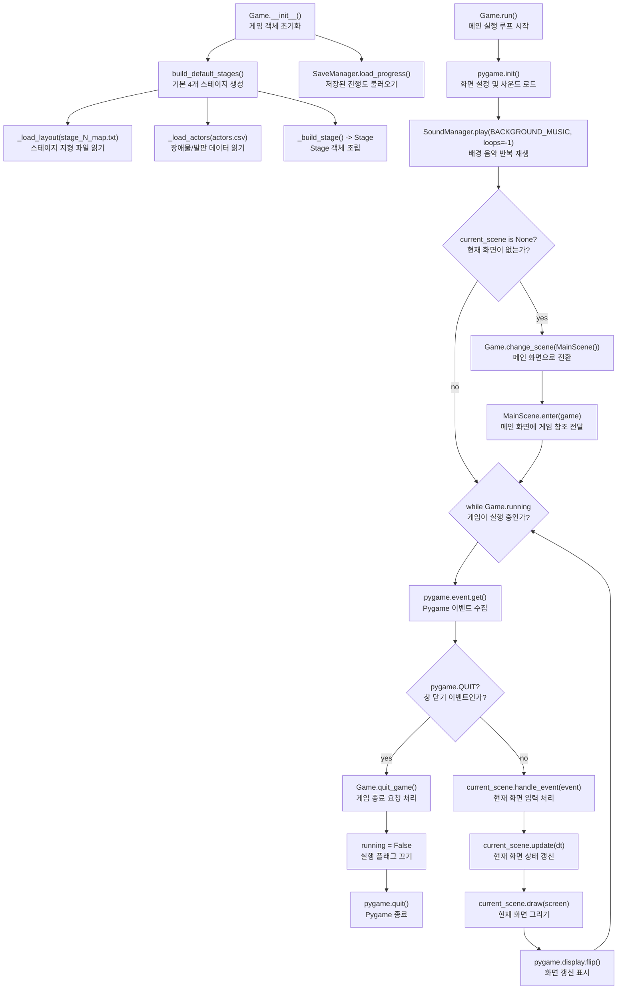
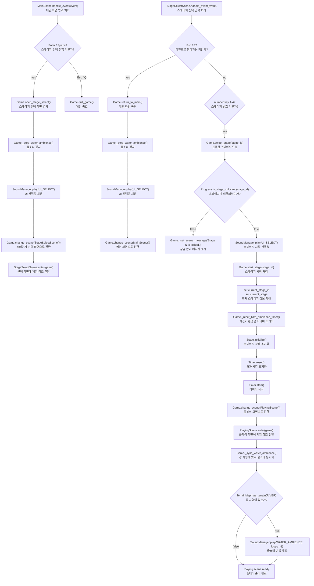

# Method-Level Game Flow Diagram

## Purpose

This document shows the current game flow at the method-call level.
It complements `doc/05_sequence_diagrams.md`, which focuses on use-case
interactions, and `doc/06_class_diagram.md`, which focuses on object
responsibilities.

Each diagram node includes both the method or state name and a Korean meaning
so the game flow can be read quickly during team explanation.

## FD-01 / Runtime Loop and Scene Transitions

## FD-02 / Menu to Playing Scene

## FD-03 / Player Input, Movement, Clear, and Failure

```mermaid
flowchart TD
    input["PlayingScene.handle_event(event)<br/>플레이 화면 입력 처리"] --> keydown{"KEYDOWN?<br/>키 입력 이벤트인가?"}
    keydown -- no --> ignore["return<br/>입력 무시"]
    keydown -- Esc / B --> open_select["Game.open_stage_select()<br/>스테이지 선택으로 이동"]
    keydown -- arrow --> hopping{"hop animation active?<br/>점프 애니메이션 중인가?"}

    hopping -- yes --> ignore_hop["return until hop finishes<br/>점프가 끝날 때까지 입력 무시"]

    hopping -- no --> remember_start["start_position = player.position<br/>현재 위치 저장"]
    remember_start --> move_request["Game.move_player(direction)<br/>플레이어 이동 요청"]
    move_request --> stage_move["Stage.move_player(direction)<br/>스테이지 이동 판정 시작"]
    stage_move --> face["player.facing_direction = direction<br/>바라보는 방향 갱신"]
    face --> origin["Stage._player_interaction_position()<br/>탑승 중이면 자라의 시각 기준 칸 사용"]
    origin --> target["Position.moved(direction)<br/>목표 위치 계산"]
    target --> can_enter{"TerrainMap.can_enter(target_position)?<br/>목표 위치 진입 가능한가?"}

    can_enter -- false --> move_blocked["return MOVE_BLOCKED<br/>벽 또는 범위 밖으로 이동 차단"]
    can_enter -- true --> set_position["player.position = target_position<br/>player.mounted_turtle = None<br/>플레이어 위치 이동 및 탑승 해제"]
    set_position --> evaluate["Stage.evaluate_player_state()<br/>이동 후 상태 판정"]

    evaluate --> carried{"mounted_turtle exists and<br/>terrain cannot be entered?<br/>거북이에 실린 채 맵 밖인가?"}
    carried -- yes --> carried_fail["return MOVE_FAILED<br/>failure_reason = CARRIED_OFF_SCREEN<br/>화면 밖으로 밀려 실패"]
    carried -- no --> bike_hit{"_actor_at(bikes, player_position)?<br/>자전거와 충돌했는가?"}
    bike_hit -- yes --> bike_fail["Stage._fail(HIT_BIKE)<br/>자전거 충돌 실패"]
    bike_hit -- no --> crowd_hit{"_actor_at(student_crowds, player_position)?<br/>학생 무리와 충돌했는가?"}
    crowd_hit -- yes --> crowd_fail["Stage._fail(HIT_STUDENT_CROWD)<br/>학생 무리 충돌 실패"]
    crowd_hit -- no --> terrain["TerrainMap.get_terrain(player_position)<br/>현재 칸 지형 확인"]

    terrain --> goal{"terrain == GOAL?<br/>목적지 칸인가?"}
    goal -- yes --> cleared["return MOVE_CLEARED<br/>스테이지 클리어"]
    goal -- no --> river{"terrain == RIVER?<br/>강 칸인가?"}
    river -- no --> moved["return MOVE_MOVED<br/>일반 이동 성공"]
    river -- yes --> turtle_here{"_turtle_at(player_position)?<br/>자라의 시각 기준 칸에 있는가?"}
    turtle_here -- no --> river_fail["Stage._fail(FELL_IN_RIVER)<br/>강에 빠져 실패"]
    turtle_here -- yes --> mount["player.mounted_turtle = turtle<br/>return MOVE_MOVED<br/>거북이 탑승 성공"]

    move_blocked --> handle_result["Game._handle_move_result(result)<br/>이동 결과 처리"]
    moved --> handle_result
    mount --> handle_result
    cleared --> handle_result
    carried_fail --> handle_result
    bike_fail --> handle_result
    crowd_fail --> handle_result
    river_fail --> handle_result

    handle_result --> result_kind{"result<br/>이동 결과 종류"}
    result_kind -- MOVE_BLOCKED --> blocked_sound["SoundManager.play(BLOCKED)<br/>이동 차단음 재생"]
    result_kind -- MOVE_MOVED --> move_sound{"mounted_turtle?<br/>거북이에 탑승 중인가?"}
    move_sound -- yes --> turtle_sound["SoundManager.play(TURTLE)<br/>거북이 탑승음 재생"]
    move_sound -- no --> jump_start["SoundManager.play(MOVE_START)<br/>점프 시작음 재생"]
    result_kind -- MOVE_FAILED --> failure_from_stage["Game._handle_failure_from_stage()<br/>스테이지 실패 처리로 이동"]
    result_kind -- MOVE_CLEARED --> clear_stage["Game.clear_current_stage()<br/>스테이지 클리어 처리"]

    failure_from_stage --> splash{"failure_reason == FELL_IN_RIVER?<br/>강 추락 실패인가?"}
    splash -- yes --> splash_sound["SoundManager.play(LAKE_SPLASH)<br/>물에 빠지는 소리 재생"]
    splash -- no --> bike_collision{"failure_reason == HIT_BIKE?<br/>자전거 충돌 실패인가?"}
    splash_sound --> fail_stage
    bike_collision -- yes --> bike_collision_sound["SoundManager.play(BIKE_COLLISION)<br/>자전거 충돌음 재생"]
    bike_collision -- no --> fail_stage["Game.fail_current_stage(reason)<br/>실패 화면 전환 준비"]
    bike_collision_sound --> fail_stage
    fail_stage --> stop_water["Game._stop_water_ambience()<br/>물소리 정지"]
    stop_water --> failed_scene["Game.change_scene(FailedScene())<br/>실패 화면으로 전환"]
    failed_scene --> failure_sound["SoundManager.play(FAILURE_SCREEN)<br/>실패 화면 효과음 재생"]

    clear_stage --> timer_stop["Timer.stop()<br/>클리어 시간 측정 종료"]
    timer_stop --> clear_stop_water["Game._stop_water_ambience()<br/>물소리 정지"]
    clear_stop_water --> elapsed["Timer.get_elapsed_time()<br/>클리어 시간 가져오기"]
    elapsed --> stars["StarRating.calculate(clear_time, stage_id)<br/>별점 계산"]
    stars --> record["Progress.record_stage_clear(stage_id, stars)<br/>해금 및 최고 별점 갱신"]
    record --> save["SaveManager.save_progress(progress)<br/>진행도 저장"]
    save --> result_scene["Game.change_scene(ResultScene())<br/>결과 화면으로 전환"]
    result_scene --> clear_sound["SoundManager.play(CLEAR_SCREEN)<br/>클리어 효과음 재생"]

    jump_start --> hop_setup{"scene still PlayingScene<br/>and position changed?<br/>아직 플레이 화면이고 위치가 바뀌었는가?"}
    turtle_sound --> hop_setup
    blocked_sound --> set_blocked_hop["_hop_start_position = start_position<br/>_hop_end_position = target_position<br/>_hop_elapsed = 0<br/>_hop_plays_success = false<br/>막힌 방향으로 짧게 폴짝"]
    hop_setup -- yes --> set_hop["_hop_start_position = start_position<br/>_hop_end_position = player.position<br/>_hop_elapsed = 0<br/>_hop_plays_success = true<br/>점프 애니메이션 상태 설정"]
    hop_setup -- no --> end_input
    set_hop --> end_input
    set_blocked_hop --> end_input
```

## FD-04 / Per-Frame Stage Update

```mermaid
flowchart TD
    scene_update["PlayingScene.update(dt)<br/>플레이 화면 프레임 갱신"] --> hop_active{"hop animation active?<br/>점프 애니메이션 중인가?"}
    hop_active -- yes --> hop_tick["_hop_elapsed += dt<br/>점프 시간 누적"]
    hop_tick --> hop_done{"_hop_elapsed >= HOP_DURATION?<br/>점프 시간이 끝났는가?"}
    hop_done -- yes --> hop_reset["clear hop positions<br/>if _hop_plays_success: SoundManager.play(MOVE_SUCCESS)<br/>점프 상태 해제 및 성공 이동음 조건부 재생"]
    hop_done -- no --> stage_update_call
    hop_active -- no --> stage_update_call["Game.update_stage(dt)<br/>현재 스테이지 갱신 요청"]
    hop_reset --> stage_update_call

    stage_update_call --> stage_update["Stage.update(dt)<br/>스테이지 내부 상태 갱신"]
    stage_update --> sprite_updates["GameSprite.update(dt)<br/>for bikes and turtles<br/>자전거와 거북이 이동"]
    sprite_updates --> crowd_updates["StudentCrowd.update(dt)<br/>for student_crowds<br/>학생 무리 시간 갱신"]
    crowd_updates --> wrap_bikes["_wrap_position_sprites_in_bounds(bikes)<br/>자전거 위치 맵 안으로 순환"]
    wrap_bikes --> evaluate["Stage.evaluate_player_state()<br/>현재 플레이어 상태 판정"]
    evaluate --> failed{"move_result == MOVE_FAILED?<br/>실패 상태인가?"}
    failed -- yes --> update_failed["return UPDATE_FAILED<br/>프레임 갱신 실패 반환"]
    failed -- no --> wrap_turtles["_wrap_turtles_in_bounds()<br/>거북이 위치 맵 안으로 순환"]
    wrap_turtles --> mounted{"player.mounted_turtle is not None?<br/>플레이어가 거북이에 탑승 중인가?"}
    mounted -- yes --> carry_player["player.position = mounted_turtle.position<br/>렌더링 오프셋 기준이 되는 자라 격자 칸으로 플레이어 이동"]
    mounted -- no --> update_result
    carry_player --> update_result{"stage update result<br/>스테이지 갱신 결과 결정"}

    update_result --> warn{"any crowd.should_warn()?<br/>학생 무리 경고 중인가?"}
    warn -- yes --> update_warning["return UPDATE_WARNING<br/>경고 상태 반환"]
    warn -- no --> active{"any crowd.became_active?<br/>학생 무리가 방금 활성화되었는가?"}
    active -- yes --> update_crowd["return UPDATE_STUDENT_CROWD_ACTIVE<br/>학생 무리 등장 반환"]
    active -- no --> ride{"player.mounted_turtle is not None?<br/>거북이 탑승 상태인가?"}
    ride -- yes --> update_ride["return UPDATE_TURTLE_RIDE<br/>거북이 탑승 반환"]
    ride -- no --> update_safe["return UPDATE_SAFE<br/>안전 상태 반환"]

    update_failed --> game_handle_update["Game._handle_stage_update_result(result)<br/>스테이지 갱신 결과 처리"]
    update_warning --> game_handle_update
    update_crowd --> game_handle_update
    update_ride --> game_handle_update
    update_safe --> game_handle_update

    game_handle_update --> kind{"result<br/>갱신 결과 종류"}
    kind -- UPDATE_FAILED --> failure_flow["Game._handle_failure_from_stage()<br/>실패 처리로 이동"]
    kind -- UPDATE_STUDENT_CROWD_ACTIVE --> crowd_sound["SoundManager.play(STUDENT_CROWD)<br/>학생 무리 효과음 재생"]
    kind -- UPDATE_WARNING / UPDATE_TURTLE_RIDE / UPDATE_SAFE --> continue_loop["continue frame<br/>현재 프레임 계속 진행"]

    game_handle_update --> bike_ambience_gate{"result != UPDATE_FAILED?<br/>실패가 아닌가?"}
    bike_ambience_gate -- yes --> bike_ambience["Game._update_bike_ambience(dt)<br/>자전거 환경음 타이밍 갱신"]
    bike_ambience_gate -- no --> no_bike_ambience["skip bike ambience<br/>자전거 환경음 건너뜀"]
    bike_ambience --> ambience_due{"elapsed >= next delay?<br/>환경음 재생 시간이 되었는가?"}
    ambience_due -- yes --> burst["_play_bike_ambience_burst()<br/>자전거 벨소리 묶음 재생"]
    ambience_due -- no --> continue_loop
    burst --> reset_delay["_random_bike_ambience_delay()<br/>다음 환경음 지연 시간 재설정"]
    reset_delay --> continue_loop
```

## FD-05 / Rendering Pipeline in PlayingScene

```mermaid
flowchart TD
    draw["PlayingScene.draw(surface)<br/>플레이 화면 전체 그리기"] --> elapsed["Timer.get_elapsed_time()<br/>HUD용 경과 시간 계산"]
    elapsed --> layout["_calculate_grid_layout(width, height, rows, columns, focus)<br/>2.5D 격자 배치 계산"]
    layout --> terrain["_draw_terrain_grid(surface, terrain_map, grid_rect, cell_size, stage_id)<br/>지형 타일 그리기"]
    terrain --> terrain_loop["TerrainMap.get_terrain(position)<br/>_cell_rect()<br/>_tile_points()<br/>각 칸의 지형과 화면 좌표 계산"]
    terrain_loop --> goal_asset{"terrain == GOAL<br/>and _get_goal_image(stage_id)?<br/>목적지 이미지가 있는가?"}
    goal_asset -- yes --> goal_draw["_blit_scaled_centered(goal_image, rect)<br/>목적지 이미지 그리기"]
    goal_asset -- no --> crowds
    goal_draw --> crowds["_draw_student_crowds(...)<br/>학생 무리 경고/등장 그리기"]

    crowds --> crowd_runners["_draw_student_crowd_runners(...)<br/>학생 무리 달리는 프레임 그리기"]
    crowd_runners --> crowd_warning["_draw_student_crowd_warning(...)<br/>학생 무리 경고 이미지 그리기"]
    crowd_warning --> moving_sprites["_draw_position_sprites(turtles)<br/>_draw_position_sprites(bikes)<br/>거북이와 자전거 그리기"]
    moving_sprites --> sprite_rects["_get_sprite_draw_rects()<br/>_move_rect_by_sprite_progress()<br/>_move_rect_by_grid_progress()<br/>이동 진행도에 맞춘 화면 위치 계산"]
    sprite_rects --> sprite_assets["_get_turtle_image()<br/>_get_bike_image()<br/>이동 객체 이미지 선택"]
    sprite_assets --> player["_draw_player(surface, player, grid_rect, cell_size)<br/>플레이어 그리기"]
    player --> player_rect["_get_player_draw_rect()<br/>점프/탑승 상태를 반영한 플레이어 위치 계산"]
    player_rect --> player_asset["_get_player_image(player.facing_direction)<br/>바라보는 방향의 거위 이미지 선택"]
    player_asset --> hud["_draw_playing_hud(surface, title_font, body_font, stage_text, elapsed_text)<br/>스테이지 번호와 경과 시간 HUD 그리기"]
```

## Method Reading Guide

| Flow area | Start method | Main collaborators |
|---|---|---|
| Program boot / 프로그램 시작 | `Game.__init__()` | `build_default_stages()`, `SaveManager.load_progress()` |
| Main loop / 메인 루프 | `Game.run()` | `current_scene.handle_event()`, `current_scene.update()`, `current_scene.draw()` |
| Stage entry / 스테이지 진입 | `Game.start_stage(stage_id)` | `Stage.initialize()`, `Timer.reset()`, `Timer.start()`, `PlayingScene.enter()` |
| Player movement / 플레이어 이동 | `PlayingScene.handle_event()` | `Game.move_player()`, `Stage.move_player()`, `Stage.evaluate_player_state()` |
| Collision and terrain decision / 충돌 및 지형 판정 | `Stage.evaluate_player_state()` | `TerrainMap.get_terrain()`, `TerrainMap.can_enter()`, `_actor_at()`, `_turtle_at()` |
| Frame update / 프레임 갱신 | `PlayingScene.update(dt)` | `Game.update_stage(dt)`, `Stage.update(dt)`, `GameSprite.update(dt)` |
| Failure transition / 실패 화면 전환 | `Game.fail_current_stage(reason)` | `_handle_failure_from_stage()`, `FailedScene.enter()`, `SoundManager.play()` |
| Clear transition / 클리어 화면 전환 | `Game.clear_current_stage()` | `Timer.stop()`, `StarRating.calculate()`, `Progress.record_stage_clear()`, `SaveManager.save_progress()` |
| Result/failure menu / 결과 및 실패 화면 메뉴 | `FailedScene.handle_event()`, `ResultScene.handle_event()` | `_dispatch_end_scene_keys()`, `restart_stage()`, `start_next_stage()`, `open_stage_select()`, `return_to_main()` |
| Playing render / 플레이 화면 렌더링 | `PlayingScene.draw(surface)` | `_draw_terrain_grid()`, `_draw_student_crowds()`, `_draw_position_sprites()`, `_draw_player()`, `_draw_playing_hud()` |
